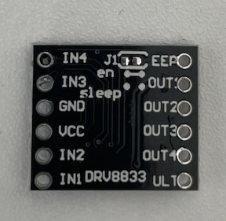
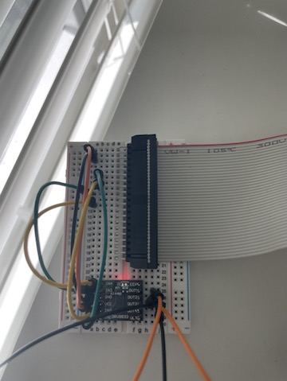

    Lately, I've been curious if embedded machine learing could simplify life, primarily along the lines of having a robot assistant or improved home automation. This blog post is about getting the basic hardware in shape for working towards that goal.

#### Choosing the processor

     When hobbists think about processors for embedded applications, the one that first comes to mind is the <a href="https://www.raspberrypi.com/">Raspberry Pi</a>. However, supply chain issues in recent years have made it really hard to obtain one. For this reason, I started researching for alternate candidates and among them Jetson Nano was a clear winner. Jetson Nano is a small yet powerful computer developed by Nvidia Inc.  It can run AI frameworks and models, and is very power efficient. It is also supported by <a href="https://developer.nvidia.com/embedded/jetpack">Nvidia's JetPack SDK</a>.

     In addition, it is priced reasonably for the hardware included!

     The robot we build here is similar to the <a href="https://jetbot.org/master/">Jetbot</a>.

#### Building the Chassis

For the load bearing component, I used components from <a href="https://www.amazon.com/Mixse-Tracking-Chassis-Compatible-Electric/dp/B08RMTJ8RP/">this</a> set. As seen in the pictures, the motion is controlled by the two wheels (motors) on either side and a rear-end freewheel. For the motors, instead of using the ones that came with this set, I've used <a href="https://www.amazon.com/Augiimor-Reduction-Gearwheel-Gearbox-Electric/dp/B08B3L7T8D/">these</a> N20 motors.


<div align="left">
  
  
</div>  

##### The Motor Driver Circuit

Write motor driver circuit details here

#### Powering the processor

Details of UPS and connecting it to jetson nano

#### GPIO Controls


```html
---
layout: post
title:  "Inception Movie"
author: john
categories: [ Jekyll, tutorial ]
tags: [red, yellow]
image: assets/images/11.jpg
description: "My review of Inception movie. Actors, directing and more."
rating: 4.5
---
```
