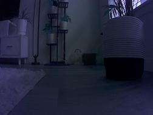
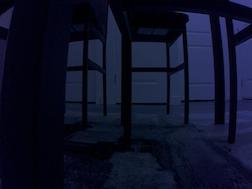

In the <a href="https://srjit.github.io/elementary-blocks-of-robotics/">previous post</a> we discussed the basics of building a robot; mostly the electronics and mechanical components of it, with a little bit of the programming for basic motion. Here, in the following iteration we will be making the robot a little more intelligent with some machine learning!

It was my friend's suggestion to modify the robot's construction and use a tank chassis since the wheels weren't aligned enough resulting in sideways movement during forward motion. A tank track could also easily climb through the carpets and other uneven sufaces in my house. In addition, it can rotate or turn around itself any degree with minimal motion sideways. The picture shows the modified version of the robot. Although the mechanical parts have changed, this code that was used before is the same here to drive it.

#### Additional Hardware

##### Camera Module

The camera that is being used here is <a href="https://www.aliexpress.us/item/2255800029242375.html">IMX219</a>, an infrared camera with 160 Degree FOV. It is assisted by two IR Leds on either sides as seen in the picture. The picture quality from this camera isn't great from my experience, however for our project this does decently well.

##### Wireless

For the wifi module, <a href="https://www.amazon.com/gp/product/B07SM4SPLV">this</a> Dual Mode AC8265 Wireless NIC Module is being used. Since python modules need to be installed, and some prebuilt models need to be downloaded, having a steady wifi connection would be a plus!

#### Automating Movement

##### Objective

One of the issues with the previous version of the robot, as mentioned earlier was its uncontrolled sideways motion although it was set on a straight path. In my case, this resulted in the robot drifting slowly off onto my fur floor carpet and getting stuck, or running off to under my furniture.

A little bit of computer vision based deep learning is used here to automate the motion of the robot.

##### Designing & Implementing the solution

1. Data Collection: I started off by defining a track for the robot, around the region of motion; in my case, this was my living room. To teach the robot about the track, plently of pictures were taken using the robot's camera (what it could see during its motion). The pictures included parts of the normal track, what it'd see if it drifted sideways, or if it ran into some furniture.

Some regions where the robot is expected to move forward (straight path besides the carpet):

  
  

 

Some regions where the robot is expected to reverse its path (eg. About to get stuck near some furniture, or near my house plant):

  
  

The idea here was to let the robot move a minimal amount of distance, capture a picture and let it decide which direction to move next. For training the first version of the decision making, I collected 500 images of my room.

2. The classifier: At least for the first version of decision making, I'll be keeping things simple with a small multi-class classfier. The classifier has 4 classes (directions) - forward, reverse, turn-left, turn-right. To make things easy all the collected images were grouped into 4 different folders with the classname (direction) as foldername.

3. Training: After a bunch of experiments coding and tuning classifiers, I turned to <a href="https://en.wikipedia.org/wiki/Transfer_learning">Transfer learning</a>. Using PyTorch framework, I loaded AlexNet and changed the fully connected layer to return the number of classes (4) in this use case.
 . The training code can be found <a href="https://github.com/srjit/jetson-scripts/blob/main/01%20Environment/train-decision-making.ipynb">here</a>. The model reaches 99% accuracy in about 50 epochs. I wasn't getting decent enough accuracy during early experiments. To check if I was losing accuracy for a specific class, I had the class level error rates printed out for each epoch. The best model was saved during training as `best_model_tank_v1.pth`.

4. Coding the <b>Next-Step Decision Maker</b>: 

